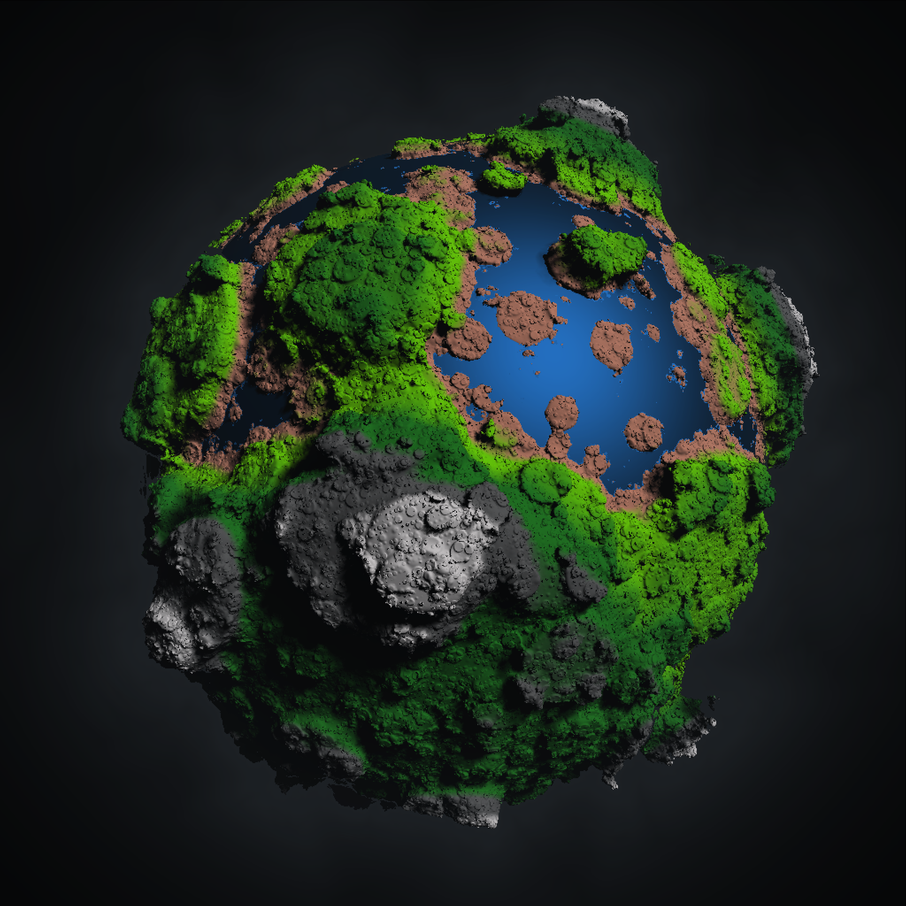

# CS 201 BK Project 2

## Dependency

This project depends on [StdDraw](https://introcs.cs.princeton.edu/java/stdlib/StdDraw.java.html) (included in the project) and [javax.vecmath](https://docs.oracle.com/cd/E17802_01/j2se/javase/technologies/desktop/java3d/forDevelopers/j3dapi/javax/vecmath/package-summary.html).

To install javax.vecmath on Debian/Ubuntu based systems, run `apt install libvecmath-java`. It might also be necessary to set the `CLASSPATH` environment variable by executing `export CLASSPATH=$CLASSPATH:/usr/share/java/*`.

## Build

`javac *.java`

## Run

`java RayMarcher`
